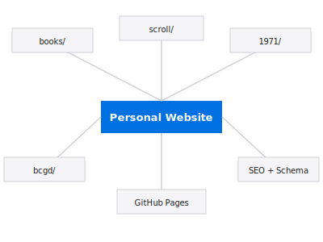

  
  <h1>nulljosh.github.io</h1>

Joshua Trommel's portfolio site.

## Architecture

**Live:** [heyitsmejosh.com](https://heyitsmejosh.com)

## What's here

- `index.html` — main portfolio
- `bcgd/` — BC Garage Doors redesign ([live](https://heyitsmejosh.com/bcgd/))
- `books/` — reading list
- `scroll/` — infinite scroll experiment
- `1971/` — history project

## Design

Minimal type-only aesthetic inspired by [Noah Dunnagan's nd.mt](https://x.com/noahdunnagan/status/1891193273389019406). No cards, no glass, no blur. System fonts, 640px max-width, animated underline links, view-transition theme toggle.

## Setup

Just HTML/CSS/JS. Push to `main` and GitHub Pages deploys automatically.

Custom domain via `CNAME` -> `heyitsmejosh.com`

## Roadmap

- [ ] Project showcase section
- [ ] Resume/CV page
- [ ] Dark mode toggle
- [ ] Blog integration (link to journal)
- [ ] Analytics (privacy-respecting)

## Quick Commands
- `./scripts/simplify.sh` - normalize project structure
- `./scripts/monetize.sh . --write` - generate monetization plan (if available)
- `./scripts/audit.sh .` - run fast project audit (if available)
- `./scripts/ship.sh .` - run checks and ship (if available)
