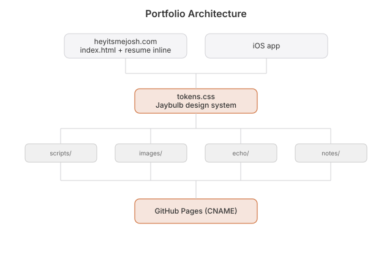

# nulljosh.github.io

  

Me, on the internet. Portfolio and project hub at [heyitsmejosh.com](https://heyitsmejosh.com).

## Projects

| Path | Description |
|------|-------------|
| `/` | Homepage |

## Stack

Static HTML, CSS and JavaScript. No build step. Geist (woff2, `font-display: swap`). Live data from GitHub, Letterboxd, Trakt, Open-Meteo weather and the blog feed. Native iOS companion app (`ios/`) plus an Apple Watch companion (`watchos/`) with the work list and bio ported for the wrist.

## Deploy

Push to `main`. GitHub Pages deploys it through Actions. The domain is in `CNAME`.

## License

MIT 2026 Joshua Trommel

## Whitepaper

[Technical whitepaper](WHITEPAPER.md)

## Architecture

