# BC Garage Doors - Website Redesign

Modern redesign of [bcgaragedoors.ca](https://bcgaragedoors.ca) using Apple Liquid Glass aesthetic.

**Live:** [heyitsmejosh.com/bcgd](https://heyitsmejosh.com/bcgd/)

## About the Business

- **Best Choice Garage Door Services Inc.** (trade name: BC Garage Doors)
- Family-owned, three generations — founded by Brian Trommel
- 30+ years experience, repair-only (no new door installs)
- LiftMaster specialists
- 4.9/5 stars (128 reviews)
- 24/7 emergency service
- Serving all of Lower Mainland BC (Vancouver to Abbotsford)
- Phone: (604) 240-0180

## Design

- Apple Liquid Glass: frosted glass panels, `backdrop-filter: blur(20px)`, translucent backgrounds
- `-apple-system` font stack, `#f5f5f7` background, `#0071e3` CTAs
- Mobile-responsive with hamburger nav
- Scroll-reveal animations via IntersectionObserver
- Single-page with all content: hero, services, about, process, reviews, tips, areas, FAQ, contact

## Site Map

```mermaid
graph TD
    A[BC Garage Doors] --> B[Hero]
    A --> C[Services]
    A --> D[About]
    A --> E[Reviews]
    A --> F[Contact]

    C --> C1[Springs]
    C --> C2[Cables]
    C --> C3[Hinges]
    C --> C4[Emergency 24/7]
    C --> C5[Keypads]
    C --> C6[Clickers/Remotes]
    C --> C7[Panels]
    C --> C8[Weather Strips]
    C --> C9[Rollers]
    C --> C10[Maintenance]
    C --> C11[General Repair]

    A --> G[Safety Tips]
    G --> G1[Misaligned Door]
    G --> G2[Broken Spring]
    G --> G3[Weight Balance]
    G --> G4[Stripped Gear]

    A --> H[FAQ]
    A --> I[Service Areas]
    I --> I1[Vancouver]
    I --> I2[Burnaby]
    I --> I3[Surrey]
    I --> I4[Langley]
    I --> I5[+ 14 more cities]

    style A fill:#0071e3,color:#fff
    style C fill:#34c759,color:#fff
    style D fill:#ff9500,color:#fff
    style E fill:#af52de,color:#fff
    style F fill:#ff3b30,color:#fff
```



## Content

- 11 services with detailed descriptions and warning signs
- 6 customer reviews with full quotes
- 4 safety tips for homeowners
- 7 FAQ items with expandable answers
- 18 service areas across Lower Mainland
- Original images from live site (logo, truck, team, portraits)

## Project Map

```svg
<svg xmlns="http://www.w3.org/2000/svg" viewBox="0 0 680 420" width="680" height="420" style="font-family:monospace;background:#f8fafc;border-radius:12px">
  <rect width="680" height="420" rx="12" fill="#f8fafc"/>
  <text x="340" y="28" text-anchor="middle" font-size="13" font-weight="bold" fill="#1e293b">bcgd — File Structure</text>
  <rect x="265" y="44" width="150" height="32" rx="6" fill="#0071e3" opacity="0.9"/>
  <text x="340" y="65" text-anchor="middle" font-size="11" fill="white" font-weight="bold">bcgd/ (root)</text>
  <rect x="30" y="118" width="110" height="28" rx="5" fill="#fef3c7" stroke="#fbbf24" stroke-width="1"/>
  <text x="85" y="136" text-anchor="middle" font-size="10" fill="#92400e">index.html</text>
  <rect x="150" y="118" width="120" height="28" rx="5" fill="#e0f2fe" stroke="#7dd3fc" stroke-width="1"/>
  <text x="210" y="136" text-anchor="middle" font-size="10" fill="#0369a1">design-tokens.css</text>
  <rect x="280" y="118" width="80" height="28" rx="5" fill="#6366f1" opacity="0.85"/>
  <text x="320" y="136" text-anchor="middle" font-size="10" fill="white">img/</text>
  <rect x="370" y="118" width="80" height="28" rx="5" fill="#6366f1" opacity="0.85"/>
  <text x="410" y="136" text-anchor="middle" font-size="10" fill="white">skills/</text>
  <rect x="460" y="118" width="80" height="28" rx="5" fill="#dcfce7" stroke="#86efac" stroke-width="1"/>
  <text x="500" y="136" text-anchor="middle" font-size="10" fill="#166534">README.md</text>
  <rect x="550" y="118" width="80" height="28" rx="5" fill="#dcfce7" stroke="#86efac" stroke-width="1"/>
  <text x="590" y="136" text-anchor="middle" font-size="10" fill="#166534">CLAUDE.md</text>
  <line x1="340" y1="76" x2="85" y2="118" stroke="#94a3b8" stroke-width="1" stroke-dasharray="4,2"/>
  <line x1="340" y1="76" x2="210" y2="118" stroke="#94a3b8" stroke-width="1" stroke-dasharray="4,2"/>
  <line x1="340" y1="76" x2="320" y2="118" stroke="#94a3b8" stroke-width="1" stroke-dasharray="4,2"/>
  <line x1="340" y1="76" x2="410" y2="118" stroke="#94a3b8" stroke-width="1" stroke-dasharray="4,2"/>
  <line x1="340" y1="76" x2="500" y2="118" stroke="#94a3b8" stroke-width="1" stroke-dasharray="4,2"/>
  <line x1="340" y1="76" x2="590" y2="118" stroke="#94a3b8" stroke-width="1" stroke-dasharray="4,2"/>
  <rect x="180" y="230" width="320" height="60" rx="8" fill="#f1f5f9" stroke="#cbd5e1" stroke-width="1"/>
  <text x="340" y="255" text-anchor="middle" font-size="11" fill="#475569" font-weight="bold">BC Garage Doors — Marketing Site</text>
  <text x="340" y="272" text-anchor="middle" font-size="10" fill="#64748b">static HTML · production</text>
  <rect x="20" y="368" width="12" height="12" rx="2" fill="#fef3c7" stroke="#fbbf24" stroke-width="1"/>
  <text x="38" y="379" font-size="9" fill="#64748b">entry</text>
  <rect x="90" y="368" width="12" height="12" rx="2" fill="#6366f1"/>
  <text x="108" y="379" font-size="9" fill="#64748b">assets</text>
  <rect x="160" y="368" width="12" height="12" rx="2" fill="#dcfce7" stroke="#86efac" stroke-width="1"/>
  <text x="178" y="379" font-size="9" fill="#64748b">docs</text>
</svg>
```


## Growth Roadmap (BCGD -> Vertical AI Ops Company)

### The Thesis

There are ~3.5 million home service businesses in North America. Most are 1-10 person operations run by tradespeople who are excellent at their craft and terrible at running a business. They lose 30-50% of inbound calls (after hours, on a job, driving). They don't follow up on quotes. They don't chase unpaid invoices. They don't reactivate past customers. Every one of these failures is recoverable revenue, and the fix is the same across verticals.

BCGD is the proof-of-concept. Brian's operation is the canonical example: great reputation, high skill, strong demand, but constrained by the same manual ops bottlenecks as every other tradesperson running their own shop. The product is the ops layer that sits between their phone ringing and cash hitting their account.

### Why This Wins (and Why Most Competitors Don't)

**The competitive landscape is weak despite being crowded.**

ServiceTitan ($9.5B valuation, IPO'd 2024) targets large operations (50+ employees, $10M+ revenue). Housecall Pro and Jobber target mid-market. All three are traditional SaaS: dashboards, calendars, dispatch boards. They require the owner to actively use the software. That's the fundamental problem -- a guy crawling under a garage door at 7 AM is not going to "use software." He needs the software to use itself.

The AI-native angle is the wedge:
- **ServiceTitan** = ERP for large contractors. Overkill for BCGD-sized shops. $300-$500+/mo.
- **Housecall Pro / Jobber** = SaaS tools the owner has to operate. $50-$200/mo.
- **This** = Autonomous ops agent. Answers the phone, books the job, sends reminders, chases payment. Owner gets a daily text summary. Zero screen time required.

The positioning is "autopilot for your business" not "here's another dashboard."

**Your specific edge:**
1. You already have Callie (AI phone agent via Twilio). It exists. It makes calls. Most competitors are starting from zero on voice AI.
2. You already have OpenClaw (multi-channel AI gateway). SMS, iMessage, voice -- all channels through one system.
3. You have a live customer on day one: your dad. Real data, real feedback, no cold-start problem.
4. You understand the domain at a cellular level. You grew up in this business. You know what "stripped gear" means. That domain knowledge compounds in prompt engineering, workflow design, and customer conversations in ways a VC-backed team of Stanford grads will never match.

### Market Sizing

**Bottom-up (garage door repair only):**
- ~12,000 garage door companies in North America
- Target: independent operators, 1-5 person shops
- ~8,000 fit the profile
- At $200/mo average revenue per account: $19.2M ARR at full penetration
- That's a lifestyle business ceiling. Not interesting alone.

**Expanded (all home services):**
- Garage doors, HVAC, plumbing, electrical, locksmith, appliance repair, pest control, roofing, fencing, landscaping, pool service, cleaning
- ~3.5 million businesses in NA, ~2 million are sub-10-employee
- Even 1% penetration at $200/mo = $48M ARR
- 5% = $240M ARR
- The market is enormous and fragmented. No one owns it for the micro-operator segment.

**Top-down sanity check:**
- US home services market: ~$600B/year
- Software/ops spend is ~2-3% of revenue for these businesses
- That's a $12-18B software TAM
- ServiceTitan captures maybe $500M of that. The rest is Excel, paper, and voicemail.

### Unit Economics

**Cost to serve per customer:**
- Twilio voice: ~$0.02/min inbound. Average call 3 min = $0.06/call. At 200 calls/mo = $12/mo
- Twilio SMS: $0.0079/msg. At 300 msgs/mo (reminders, follow-ups) = $2.37/mo
- LLM inference (Claude via OpenClaw): ~$0.01-0.05 per interaction. At 500 interactions/mo = $10-25/mo
- Infrastructure (hosting, DB, monitoring): ~$5/mo amortized at scale
- **Total COGS per customer: $25-45/mo**

**Revenue per customer:**
- Base subscription: $149-$249/mo (covers phone, SMS, scheduling, follow-up)
- Performance fee: 10-15% of recovered revenue (missed calls converted, overdue invoices collected)
- Average blended revenue: $200-$350/mo per customer

**Gross margin: 75-85%.** This is a software business, not a services business.

**LTV/CAC target:**
- LTV at $250/mo, 24-month average retention = $6,000
- Target CAC: $500-$800 (referral-heavy, demo-driven)
- LTV:CAC ratio of 7-12x is exceptional

### Phase 1: Proof of Life (0-90 days)

**Goal:** Get BCGD running on the full stack. Generate a single undeniable metric: "X missed calls recovered, worth $Y in booked jobs."

Concrete deliverables:
1. **Callie answers BCGD's overflow/after-hours calls.** Not a demo. Real calls from real customers. Callie triages (emergency vs. routine), captures details (address, door type, symptom), and books into Brian's calendar.
2. **Missed-call text-back.** Every unanswered call gets an immediate SMS: "Hey, this is BC Garage Doors. Sorry we missed you -- what's going on with your door?" Simple. Recovers 20-30% of lost calls.
3. **Appointment reminders.** Day-before and morning-of SMS. Reduces no-shows by 30-50%.
4. **Weekly owner digest.** Brian gets a text every Sunday: calls received, calls missed, calls recovered, jobs booked, revenue attributed. One screen. No login.

**What you are NOT building:**
- A dashboard
- A CRM
- An app
- Anything Brian has to log into

The entire interface is phone calls and text messages. That's the insight most SaaS companies miss about this market segment.

### Phase 2: Second Customer (90-180 days)

**Goal:** Prove it works for someone who isn't your dad.

Find one more home service business in the Lower Mainland. Ideally a different vertical (plumber, locksmith, HVAC) to prove cross-vertical portability. Offer it free for 90 days in exchange for full access to their call data and permission to use them as a case study.

Deliverables:
1. **Onboarding playbook.** Document exactly what it takes to get a new business live. Twilio number setup, call forwarding config, business hours, service menu, pricing context for the AI.
2. **Vertical-agnostic prompt templates.** The AI needs to know garage door symptoms vs. plumbing symptoms. Build a structured "business profile" format that captures: services offered, common problems, pricing ranges, emergency criteria, service area, scheduling constraints.
3. **Retention data.** Does the second customer keep using it after the free period? If yes, you have a product. If no, you have a project.

### Phase 3: Revenue (6-12 months)

**Goal:** 10 paying customers, $2K+/mo MRR.

Distribution channels (ranked by expected ROI):
1. **Brian's referral network.** Every tradesperson knows other tradespeople. Brian knows the HVAC guy, the plumber, the electrician. Warm intros are worth 10x cold outreach. Offer Brian a referral fee.
2. **Google Business Profile outreach.** Search "garage door repair [city]" or "plumber [city]" across BC. Every listing with a phone number that goes to voicemail after 5 PM is a prospect. Call them. "Hey, I noticed your phone goes to voicemail at night. We built a system that answers for you and books jobs while you sleep. Can I show you?"
3. **Local trade associations.** BC trades have associations, Facebook groups, supply house communities. One talk at a LiftMaster dealer meetup could generate 5-10 leads.
4. **Case study content.** "BC Garage Doors recovered $X in missed calls in 90 days" -- turn that into a one-pager, a short video, a Google ad landing page.

**Pricing at this stage:**
- $199/mo flat for core (phone + SMS + scheduling + reminders)
- $299/mo for full (adds follow-up sequences, collections nudges, reactivation campaigns)
- No contracts. Month-to-month. These customers hate being locked in.
- Performance bonus: optional 10% of recovered revenue (overdue invoice collections) -- aligns incentives

### Phase 4: Productize (12-24 months)

**Goal:** Self-serve onboarding, multi-vertical, 50-100 customers, $10K-$25K MRR.

This is where it transitions from "Josh manually sets up each customer" to "customer signs up on a website and is live in 24 hours."

Key infrastructure:
1. **Multi-tenant ops engine.** Each customer gets their own Twilio number, prompt configuration, calendar integration, and reporting. All running on shared infrastructure.
2. **Business profile builder.** Web form or guided call where the owner describes their business, services, pricing, hours, and the system generates the AI configuration automatically.
3. **Self-serve dashboard (minimal).** Not a full SaaS dashboard. Just: weekly stats, billing, and a "pause/resume" toggle. The owner should never need to open this more than once a month.
4. **Vertical playbooks.** Garage doors, HVAC, plumbing, electrical, locksmith, appliance repair. Each vertical gets tuned prompts, common problem taxonomies, and pricing context. This is where the data flywheel kicks in -- every conversation trains the next one.

### Phase 5: Scale or Exit (24+ months)

At $25K+ MRR with strong retention (>90% monthly) and proven cross-vertical portability, you have optionality:

**Option A: Keep compounding.** Hire 1-2 people (sales + ops), push to $100K MRR. At 80% gross margin that's a $960K/year profit machine with no VC, no board, no dilution. You own 100%.

**Option B: Raise a seed round.** $50K MRR, 50+ customers, cross-vertical proof, strong retention = a credible seed deck. Raise $1-3M to hire a sales team and push into US markets. Home services are identical in Portland, Seattle, Denver, Phoenix.

**Option C: Strategic acquisition.** ServiceTitan, Housecall Pro, or Jobber would pay 8-15x ARR for a product that solves the micro-operator segment they can't reach. At $500K ARR that's a $4-7.5M exit. At $2M ARR that's $16-30M.

**Option D: Franchise the playbook.** License the system to local agencies/consultants who onboard customers in their market. You build the platform, they do the sales. Revenue share model.

### The Data Moat

This is the part most people miss when they look at "AI for small business" plays.

Every phone call, every SMS exchange, every booking, every no-show, every collected invoice -- it's training data. After 1,000 garage door repair calls, the AI knows that "my door makes a loud bang and won't go up" is a broken spring (emergency, $300-$400 job, book today). After 10,000 calls across verticals, the system has a proprietary understanding of home service customer intent that no competitor can replicate without processing the same volume.

The workflow graph (call -> triage -> book -> remind -> complete -> invoice -> collect -> reactivate) is the same across verticals. The domain knowledge (what symptoms map to what jobs at what prices) is the differentiator. That knowledge accumulates with every customer interaction and every business onboarded.

**Moat layers:**
1. Proprietary call/conversation data across verticals
2. Tuned prompt libraries per service type
3. Conversion benchmarks (what follow-up timing works, what SMS copy converts)
4. Network effects: more customers = more data = better AI = higher conversion = more customers

### Risk Factors (Honest Assessment)

1. **Twilio dependency.** Voice AI through Twilio works but it's not cheap at scale and quality varies. Latency on AI-generated responses can feel unnatural. Mitigation: monitor call quality metrics, have fallback to human answering service for high-value calls.

2. **AI hallucination in high-stakes contexts.** If Callie books a job at the wrong time or quotes the wrong price, that erodes trust fast. Mitigation: constrain the AI's action space aggressively. It can book into available slots and quote price ranges, but it cannot make commitments outside defined parameters. Always include "the technician will confirm pricing on-site."

3. **Owner trust.** Tradespeople are skeptical of technology. "AI answering my phone" sounds like a scam to a 55-year-old plumber. Mitigation: lead with the result ("we recovered 12 missed calls worth $3,400 last month"), not the technology ("we use advanced AI"). Never say "AI" in marketing to this segment. Say "24/7 answering and booking service."

4. **Churn.** Small businesses churn hard on software. Industry average is 5-8% monthly for SMB SaaS. Mitigation: outcome-based pricing (they only pay when it works), no contracts, and the daily/weekly digest keeps them aware of value delivered.

5. **Key-man risk (you).** Right now this is a one-person operation. If you get hit by a bus, the product dies. Mitigation: document everything, make the system self-healing, and get to revenue fast enough to hire before burning out.

6. **Regulatory.** TCPA (US) and CASL (Canada) regulate automated calls and texts. AI-generated calls to consumers need consent frameworks. Mitigation: all outbound is to existing customers or inbound callers (implied consent). Never cold-call consumers with AI.

### What You Already Have (Asset Inventory)

| Asset | Status | Role in Stack |
|-------|--------|---------------|
| Callie (bots/callie) | Working, Twilio integrated | AI phone agent, core product |
| OpenClaw | Working, multi-channel | AI gateway, routes all channels |
| BCGD website | Live, conversion-optimized | First customer proof point |
| Brian's business | 30 years, 4.9 stars, real volume | Day-one customer + domain advisor |
| Twilio account | Active (trial, upgrade needed) | Voice + SMS infrastructure |
| Domain knowledge | Lifelong | Unfakeable competitive advantage |

You are closer to a launchable product than most funded startups. The gap is not technology -- it's wiring Callie into BCGD's real phone line and measuring what happens.

### 12-Week Execution Plan

**Weeks 1-2: Instrument the baseline.**
- Get BCGD's current call volume data. How many calls/day? How many go to voicemail? What hours? Pull from Telus/carrier if possible, or just have Brian track manually for two weeks.
- Set up call tracking number (Twilio) that forwards to Brian's phone. Log every call: time, duration, answered/missed, outcome.
- Baseline metrics: calls/day, answer rate, booking rate, average ticket, revenue/week.

**Weeks 3-4: Deploy Callie on overflow.**
- Configure Callie to answer calls that Brian doesn't pick up within 4 rings.
- Callie's job: greet, capture problem description, capture address, capture urgency, promise callback. "Brian will call you back within 30 minutes."
- Simultaneously: missed-call text-back. Every unanswered call gets an SMS within 60 seconds.
- Start measuring: recovery rate (% of missed calls that convert to bookings).

**Weeks 5-6: Direct booking.**
- Upgrade Callie from "capture and callback" to "book directly into calendar."
- Integrate with Google Calendar or simple slot system. Callie offers available time windows.
- Add appointment confirmation SMS (immediate) and reminder SMS (day-before, morning-of).
- Measure: no-show rate before vs. after reminders.

**Weeks 7-8: Follow-up sequences.**
- Quote follow-up: if Brian gives a quote but the customer doesn't book, automated SMS at day 1, day 3, day 7. "Hey, just checking in -- still need that spring replaced? We've got a slot open Thursday."
- Post-job follow-up: "Thanks for choosing BC Garage Doors. How'd we do?" with a Google review link. Pump the review count from 128 toward 200.
- Measure: quote-to-booking conversion rate improvement.

**Weeks 9-10: Compile results.**
- 8 weeks of data. Build the case study.
- Format: "BCGD deployed AI ops in 8 weeks. Results: X% more calls answered, Y missed calls recovered ($Z revenue), W% fewer no-shows, V new Google reviews."
- Build a one-page pitch doc for the next customer.

**Weeks 11-12: Second customer outreach.**
- Use Brian's network. "Hey, do you know a plumber/HVAC guy who misses calls?"
- Offer free 90-day pilot. Full transparency on what you're measuring.
- If you can't get a warm intro, cold-call 5 service businesses whose Google listing shows they close at 5 PM. Call them at 6 PM. When you get voicemail, you have your pitch: "I just called your business and got voicemail. That's a lost customer. I built a system that would have answered that call and booked a job. Want to see it?"

### Success Metrics (Revised)

**Phase 1 (single customer):**
- Missed call recovery rate > 25%
- Appointment no-show rate reduction > 30%
- Incremental revenue attributed to system > $2,000/month
- Brian's NPS: "would you pay $200/mo to keep this?" -- yes/no

**Phase 2 (second customer):**
- Time to onboard < 48 hours
- System works for a different vertical without major rework
- Second customer willing to pay after free trial

**Phase 3 (revenue):**
- 10+ paying customers
- Monthly churn < 5%
- MRR > $2,000
- CAC < $500 (mostly referral-driven)

**Phase 4 (product):**
- Self-serve onboarding (no manual setup per customer)
- 3+ verticals supported
- 50+ customers
- MRR > $10,000
