# BC Garage Doors - Website Redesign

Modern redesign of [bcgaragedoors.ca](https://bcgaragedoors.ca) using Apple Liquid Glass aesthetic.

**Live:** [heyitsmejosh.com/bcgd](https://heyitsmejosh.com/bcgd/)

## About the Business

- **Best Choice Garage Door Services Inc.** (trade name: BC Garage Doors)
- Family-owned, three generations — founded by Brian Trommel
- 30+ years experience, repair-only (no new door installs)
- LiftMaster specialists
- 4.9/5 stars (128 reviews)
- 24/7 emergency service
- Serving all of Lower Mainland BC (Vancouver to Abbotsford)
- Phone: (604) 240-0180

## Design

- Apple Liquid Glass: frosted glass panels, `backdrop-filter: blur(20px)`, translucent backgrounds
- `-apple-system` font stack, `#f5f5f7` background, `#0071e3` CTAs
- Mobile-responsive with hamburger nav
- Scroll-reveal animations via IntersectionObserver
- Single-page with all content: hero, services, about, process, reviews, tips, areas, FAQ, contact

## Site Map

```mermaid
graph TD
    A[BC Garage Doors] --> B[Hero]
    A --> C[Services]
    A --> D[About]
    A --> E[Reviews]
    A --> F[Contact]

    C --> C1[Springs]
    C --> C2[Cables]
    C --> C3[Hinges]
    C --> C4[Emergency 24/7]
    C --> C5[Keypads]
    C --> C6[Clickers/Remotes]
    C --> C7[Panels]
    C --> C8[Weather Strips]
    C --> C9[Rollers]
    C --> C10[Maintenance]
    C --> C11[General Repair]

    A --> G[Safety Tips]
    G --> G1[Misaligned Door]
    G --> G2[Broken Spring]
    G --> G3[Weight Balance]
    G --> G4[Stripped Gear]

    A --> H[FAQ]
    A --> I[Service Areas]
    I --> I1[Vancouver]
    I --> I2[Burnaby]
    I --> I3[Surrey]
    I --> I4[Langley]
    I --> I5[+ 14 more cities]

    style A fill:#0071e3,color:#fff
    style C fill:#34c759,color:#fff
    style D fill:#ff9500,color:#fff
    style E fill:#af52de,color:#fff
    style F fill:#ff3b30,color:#fff
```



## Content

- 11 services with detailed descriptions and warning signs
- 6 customer reviews with full quotes
- 4 safety tips for homeowners
- 7 FAQ items with expandable answers
- 18 service areas across Lower Mainland
- Original images from live site (logo, truck, team, portraits)

## Project Map

```svg
<svg xmlns="http://www.w3.org/2000/svg" viewBox="0 0 680 420" width="680" height="420" style="font-family:monospace;background:#f8fafc;border-radius:12px">
  <rect width="680" height="420" rx="12" fill="#f8fafc"/>
  <text x="340" y="28" text-anchor="middle" font-size="13" font-weight="bold" fill="#1e293b">bcgd — File Structure</text>
  <rect x="265" y="44" width="150" height="32" rx="6" fill="#0071e3" opacity="0.9"/>
  <text x="340" y="65" text-anchor="middle" font-size="11" fill="white" font-weight="bold">bcgd/ (root)</text>
  <rect x="30" y="118" width="110" height="28" rx="5" fill="#fef3c7" stroke="#fbbf24" stroke-width="1"/>
  <text x="85" y="136" text-anchor="middle" font-size="10" fill="#92400e">index.html</text>
  <rect x="150" y="118" width="120" height="28" rx="5" fill="#e0f2fe" stroke="#7dd3fc" stroke-width="1"/>
  <text x="210" y="136" text-anchor="middle" font-size="10" fill="#0369a1">design-tokens.css</text>
  <rect x="280" y="118" width="80" height="28" rx="5" fill="#6366f1" opacity="0.85"/>
  <text x="320" y="136" text-anchor="middle" font-size="10" fill="white">img/</text>
  <rect x="370" y="118" width="80" height="28" rx="5" fill="#6366f1" opacity="0.85"/>
  <text x="410" y="136" text-anchor="middle" font-size="10" fill="white">skills/</text>
  <rect x="460" y="118" width="80" height="28" rx="5" fill="#dcfce7" stroke="#86efac" stroke-width="1"/>
  <text x="500" y="136" text-anchor="middle" font-size="10" fill="#166534">README.md</text>
  <rect x="550" y="118" width="80" height="28" rx="5" fill="#dcfce7" stroke="#86efac" stroke-width="1"/>
  <text x="590" y="136" text-anchor="middle" font-size="10" fill="#166534">CLAUDE.md</text>
  <line x1="340" y1="76" x2="85" y2="118" stroke="#94a3b8" stroke-width="1" stroke-dasharray="4,2"/>
  <line x1="340" y1="76" x2="210" y2="118" stroke="#94a3b8" stroke-width="1" stroke-dasharray="4,2"/>
  <line x1="340" y1="76" x2="320" y2="118" stroke="#94a3b8" stroke-width="1" stroke-dasharray="4,2"/>
  <line x1="340" y1="76" x2="410" y2="118" stroke="#94a3b8" stroke-width="1" stroke-dasharray="4,2"/>
  <line x1="340" y1="76" x2="500" y2="118" stroke="#94a3b8" stroke-width="1" stroke-dasharray="4,2"/>
  <line x1="340" y1="76" x2="590" y2="118" stroke="#94a3b8" stroke-width="1" stroke-dasharray="4,2"/>
  <rect x="180" y="230" width="320" height="60" rx="8" fill="#f1f5f9" stroke="#cbd5e1" stroke-width="1"/>
  <text x="340" y="255" text-anchor="middle" font-size="11" fill="#475569" font-weight="bold">BC Garage Doors — Marketing Site</text>
  <text x="340" y="272" text-anchor="middle" font-size="10" fill="#64748b">static HTML · production</text>
  <rect x="20" y="368" width="12" height="12" rx="2" fill="#fef3c7" stroke="#fbbf24" stroke-width="1"/>
  <text x="38" y="379" font-size="9" fill="#64748b">entry</text>
  <rect x="90" y="368" width="12" height="12" rx="2" fill="#6366f1"/>
  <text x="108" y="379" font-size="9" fill="#64748b">assets</text>
  <rect x="160" y="368" width="12" height="12" rx="2" fill="#dcfce7" stroke="#86efac" stroke-width="1"/>
  <text x="178" y="379" font-size="9" fill="#64748b">docs</text>
</svg>
```


## Growth Roadmap (BCGD -> $1B playbook)

This is the execution plan to turn BCGD from a site redesign into a vertical AI ops company.

### Phase 1: Revenue Wedge (0-90 days)
- Keep BCGD site as conversion engine (calls + quote requests)
- Add AI call handling + after-hours booking via Callie
- Add missed-call text-back automation + follow-up workflows
- Instrument funnel metrics: calls, booked jobs, close rate, revenue per lead

Target:
- 1 live customer workflow that clearly increases booked jobs
- Weekly ROI report for owner/operators

### Phase 2: Productize (3-9 months)
- Convert custom automations into a repeatable product package
- Core modules: intake, scheduling, reminders, quote follow-up, reactivation
- Add CRM + calendar + payment integrations
- Price on outcomes (booked jobs / recovered revenue), not "AI features"

Target:
- 10-30 paying local/regional customers
- Clear retention and reference case studies

### Phase 3: Scale Vertical (9-24 months)
- Expand across home services (garage doors -> HVAC/plumbing/electrical)
- Build onboarding playbooks + partner/agency channel
- Use conversation + conversion data to improve model behavior per vertical

Target:
- 7-figure ARR with strong retention
- Moat = workflow graph + proprietary ops data

### Phase 4: Platform (24+ months)
- Multi-vertical AI ops platform for SMB service businesses
- Unified command center: calls, messages, appointments, collections, analytics
- Add compliance, audit logs, and enterprise controls

Target:
- 8-9 figure ARR trajectory
- Position for sustained compounding or strategic exit

## 12-Week Build Plan (No-Fluff)

Week 1-2
- Ship conversion-focused BCGD pages + tracking baseline
- Define KPI dashboard (leads, bookings, close rate, no-show rate)

Week 3-4
- Deploy Callie-powered phone workflow (after-hours + overflow)
- Add basic safety rails and error alerts

Week 5-6
- Add follow-up automations (SMS reminders, missed-call recovery)
- Start A/B tests on booking CTA flows

Week 7-8
- Integrate scheduling + CRM sync
- Generate weekly ROI summaries automatically

Week 9-10
- Harden reliability (failure retries, runbooks, monitoring)
- Package setup docs for repeatable onboarding

Week 11-12
- Pilot with additional service businesses
- Capture case studies and tighten pricing model

## Success Metrics
- Time-to-first-booking improvement
- Missed-call recovery rate
- Booking conversion rate
- Cost per booked job
- Net revenue retained/expanded per account

## What this README roadmap changes
- BCGD is no longer just a visual redesign project.
- It becomes the first deployable vertical template for an AI-powered service-business operating system.


## BCGD Scaling Stack (Apps + Automation)

To scale BCGD into an ops platform, build these modules as connected apps/services:

### 1) AI Phone Ops (Callie)
- 24/7 inbound call handling
- After-hours overflow handling
- Emergency triage routing
- Voicemail-to-action extraction

### 2) Automated Scheduling
- Real-time slot booking from calls/SMS/web forms
- Tech dispatch assignment rules (area, skill, urgency)
- Reschedule + cancellation automation
- Calendar sync (owner + field techs)

### 3) Lead Capture + Qualification App
- Quote intake form with structured problem fields
- Instant lead scoring (hot/warm/cold)
- Auto-prioritize emergency/high-value jobs
- Duplicate lead merging

### 4) Follow-Up Engine
- Missed-call text-back flows
- Quote follow-up sequences (day 0/1/3/7)
- Appointment reminder + confirmation flows
- No-show recovery automations

### 5) Job Pipeline Dashboard
- Stages: New -> Qualified -> Booked -> Completed -> Invoiced -> Paid
- Bottleneck alerts (stalled quotes, no-response leads)
- Team and individual conversion metrics

### 6) Payments + Collections Automation
- Deposit links + invoice reminders
- Outstanding balance nudges
- Failed payment retry workflows
- Revenue recovery reporting

### 7) Customer Reactivation App
- Seasonal campaigns (maintenance checks)
- "Haven't serviced in 12+ months" reactivation list
- One-click campaign launch by service area

### 8) Owner Command Center
- Daily digest: booked jobs, missed calls, at-risk quotes
- Weekly ROI summary: cost per booking, close rate, recovered revenue
- Live ops alerts for failures

## Recommended Build Order (for real scaling)
1. AI Phone Ops + Scheduling
2. Follow-Up Engine
3. Job Pipeline Dashboard
4. Payments/Collections
5. Reactivation
6. Owner Command Center unification

## Outcome
This turns BCGD from a brochure site into a full service-business operating system: calls -> bookings -> jobs -> cash collection, mostly automated.
