# BC Garage Doors - Website Redesign

Modern redesign of [bcgaragedoors.ca](https://bcgaragedoors.ca) using Apple Liquid Glass aesthetic.

**Live:** [heyitsmejosh.com/bcgd](https://heyitsmejosh.com/bcgd/)

## About the Business

- **Best Choice Garage Door Services Inc.** (trade name: BC Garage Doors)
- Family-owned, three generations — founded by Brian Trommel
- 30+ years experience, repair-only (no new door installs)
- LiftMaster specialists
- 4.9/5 stars (128 reviews)
- 24/7 emergency service
- Serving all of Lower Mainland BC (Vancouver to Abbotsford)
- Phone: (604) 240-0180

## Design

- Apple Liquid Glass: frosted glass panels, `backdrop-filter: blur(20px)`, translucent backgrounds
- `-apple-system` font stack, `#f5f5f7` background, `#0071e3` CTAs
- Mobile-responsive with hamburger nav
- Scroll-reveal animations via IntersectionObserver
- Single-page with all content: hero, services, about, process, reviews, tips, areas, FAQ, contact

## Site Map

```mermaid
graph TD
    A[BC Garage Doors] --> B[Hero]
    A --> C[Services]
    A --> D[About]
    A --> E[Reviews]
    A --> F[Contact]

    C --> C1[Springs]
    C --> C2[Cables]
    C --> C3[Hinges]
    C --> C4[Emergency 24/7]
    C --> C5[Keypads]
    C --> C6[Clickers/Remotes]
    C --> C7[Panels]
    C --> C8[Weather Strips]
    C --> C9[Rollers]
    C --> C10[Maintenance]
    C --> C11[General Repair]

    A --> G[Safety Tips]
    G --> G1[Misaligned Door]
    G --> G2[Broken Spring]
    G --> G3[Weight Balance]
    G --> G4[Stripped Gear]

    A --> H[FAQ]
    A --> I[Service Areas]
    I --> I1[Vancouver]
    I --> I2[Burnaby]
    I --> I3[Surrey]
    I --> I4[Langley]
    I --> I5[+ 14 more cities]

    style A fill:#0071e3,color:#fff
    style C fill:#34c759,color:#fff
    style D fill:#ff9500,color:#fff
    style E fill:#af52de,color:#fff
    style F fill:#ff3b30,color:#fff
```



## Content

- 11 services with detailed descriptions and warning signs
- 6 customer reviews with full quotes
- 4 safety tips for homeowners
- 7 FAQ items with expandable answers
- 18 service areas across Lower Mainland
- Original images from live site (logo, truck, team, portraits)

## Project Map

```svg
<svg xmlns="http://www.w3.org/2000/svg" viewBox="0 0 680 420" width="680" height="420" style="font-family:monospace;background:#f8fafc;border-radius:12px">
  <rect width="680" height="420" rx="12" fill="#f8fafc"/>
  <text x="340" y="28" text-anchor="middle" font-size="13" font-weight="bold" fill="#1e293b">bcgd — File Structure</text>
  <rect x="265" y="44" width="150" height="32" rx="6" fill="#0071e3" opacity="0.9"/>
  <text x="340" y="65" text-anchor="middle" font-size="11" fill="white" font-weight="bold">bcgd/ (root)</text>
  <rect x="30" y="118" width="110" height="28" rx="5" fill="#fef3c7" stroke="#fbbf24" stroke-width="1"/>
  <text x="85" y="136" text-anchor="middle" font-size="10" fill="#92400e">index.html</text>
  <rect x="150" y="118" width="120" height="28" rx="5" fill="#e0f2fe" stroke="#7dd3fc" stroke-width="1"/>
  <text x="210" y="136" text-anchor="middle" font-size="10" fill="#0369a1">design-tokens.css</text>
  <rect x="280" y="118" width="80" height="28" rx="5" fill="#6366f1" opacity="0.85"/>
  <text x="320" y="136" text-anchor="middle" font-size="10" fill="white">img/</text>
  <rect x="370" y="118" width="80" height="28" rx="5" fill="#6366f1" opacity="0.85"/>
  <text x="410" y="136" text-anchor="middle" font-size="10" fill="white">skills/</text>
  <rect x="460" y="118" width="80" height="28" rx="5" fill="#dcfce7" stroke="#86efac" stroke-width="1"/>
  <text x="500" y="136" text-anchor="middle" font-size="10" fill="#166534">README.md</text>
  <rect x="550" y="118" width="80" height="28" rx="5" fill="#dcfce7" stroke="#86efac" stroke-width="1"/>
  <text x="590" y="136" text-anchor="middle" font-size="10" fill="#166534">CLAUDE.md</text>
  <line x1="340" y1="76" x2="85" y2="118" stroke="#94a3b8" stroke-width="1" stroke-dasharray="4,2"/>
  <line x1="340" y1="76" x2="210" y2="118" stroke="#94a3b8" stroke-width="1" stroke-dasharray="4,2"/>
  <line x1="340" y1="76" x2="320" y2="118" stroke="#94a3b8" stroke-width="1" stroke-dasharray="4,2"/>
  <line x1="340" y1="76" x2="410" y2="118" stroke="#94a3b8" stroke-width="1" stroke-dasharray="4,2"/>
  <line x1="340" y1="76" x2="500" y2="118" stroke="#94a3b8" stroke-width="1" stroke-dasharray="4,2"/>
  <line x1="340" y1="76" x2="590" y2="118" stroke="#94a3b8" stroke-width="1" stroke-dasharray="4,2"/>
  <rect x="180" y="230" width="320" height="60" rx="8" fill="#f1f5f9" stroke="#cbd5e1" stroke-width="1"/>
  <text x="340" y="255" text-anchor="middle" font-size="11" fill="#475569" font-weight="bold">BC Garage Doors — Marketing Site</text>
  <text x="340" y="272" text-anchor="middle" font-size="10" fill="#64748b">static HTML · production</text>
  <rect x="20" y="368" width="12" height="12" rx="2" fill="#fef3c7" stroke="#fbbf24" stroke-width="1"/>
  <text x="38" y="379" font-size="9" fill="#64748b">entry</text>
  <rect x="90" y="368" width="12" height="12" rx="2" fill="#6366f1"/>
  <text x="108" y="379" font-size="9" fill="#64748b">assets</text>
  <rect x="160" y="368" width="12" height="12" rx="2" fill="#dcfce7" stroke="#86efac" stroke-width="1"/>
  <text x="178" y="379" font-size="9" fill="#64748b">docs</text>
</svg>
```


## Growth Roadmap (BCGD -> Vertical AI Ops Company)

### The Thesis

There are ~3.5 million home service businesses in North America. Most are 1-10 person operations run by tradespeople who are excellent at their craft and terrible at running a business. They lose 30-50% of inbound calls (after hours, on a job, driving). They don't follow up on quotes. They don't chase unpaid invoices. They don't reactivate past customers. Every one of these failures is recoverable revenue, and the fix is the same across verticals.

BCGD is the proof-of-concept. Brian's operation is the canonical example: great reputation, high skill, strong demand, but constrained by the same manual ops bottlenecks as every other tradesperson running their own shop. The product is the ops layer that sits between their phone ringing and cash hitting their account.

### Why This Wins (and Why Most Competitors Don't)

**The competitive landscape is weak despite being crowded.**

ServiceTitan ($9.5B valuation, IPO'd 2024) targets large operations (50+ employees, $10M+ revenue). Housecall Pro and Jobber target mid-market. All three are traditional SaaS: dashboards, calendars, dispatch boards. They require the owner to actively use the software. That's the fundamental problem -- a guy crawling under a garage door at 7 AM is not going to "use software." He needs the software to use itself.

The AI-native angle is the wedge:
- **ServiceTitan** = ERP for large contractors. Overkill for BCGD-sized shops. $300-$500+/mo.
- **Housecall Pro / Jobber** = SaaS tools the owner has to operate. $50-$200/mo.
- **This** = Autonomous ops agent. Answers the phone, books the job, sends reminders, chases payment. Owner gets a daily text summary. Zero screen time required.

The positioning is "autopilot for your business" not "here's another dashboard."

**Your specific edge:**
1. You already have Callie (AI phone agent via Twilio). It exists. It makes calls. Most competitors are starting from zero on voice AI.
2. You already have OpenClaw (multi-channel AI gateway). SMS, iMessage, voice -- all channels through one system.
3. You have a live customer on day one: your dad. Real data, real feedback, no cold-start problem.
4. You understand the domain at a cellular level. You grew up in this business. You know what "stripped gear" means. That domain knowledge compounds in prompt engineering, workflow design, and customer conversations in ways a VC-backed team of Stanford grads will never match.

### Market Sizing

**Bottom-up (garage door repair only):**
- ~12,000 garage door companies in North America
- Target: independent operators, 1-5 person shops
- ~8,000 fit the profile
- At $200/mo average revenue per account: $19.2M ARR at full penetration
- That's a lifestyle business ceiling. Not interesting alone.

**Expanded (all home services):**
- Garage doors, HVAC, plumbing, electrical, locksmith, appliance repair, pest control, roofing, fencing, landscaping, pool service, cleaning
- ~3.5 million businesses in NA, ~2 million are sub-10-employee
- Even 1% penetration at $200/mo = $48M ARR
- 5% = $240M ARR
- The market is enormous and fragmented. No one owns it for the micro-operator segment.

**Top-down sanity check:**
- US home services market: ~$600B/year
- Software/ops spend is ~2-3% of revenue for these businesses
- That's a $12-18B software TAM
- ServiceTitan captures maybe $500M of that. The rest is Excel, paper, and voicemail.

### Unit Economics

**Cost to serve per customer:**
- Twilio voice: ~$0.02/min inbound. Average call 3 min = $0.06/call. At 200 calls/mo = $12/mo
- Twilio SMS: $0.0079/msg. At 300 msgs/mo (reminders, follow-ups) = $2.37/mo
- LLM inference (Claude via OpenClaw): ~$0.01-0.05 per interaction. At 500 interactions/mo = $10-25/mo
- Infrastructure (hosting, DB, monitoring): ~$5/mo amortized at scale
- **Total COGS per customer: $25-45/mo**

**Revenue per customer:**
- Base subscription: $149-$249/mo (covers phone, SMS, scheduling, follow-up)
- Performance fee: 10-15% of recovered revenue (missed calls converted, overdue invoices collected)
- Average blended revenue: $200-$350/mo per customer

**Gross margin: 75-85%.** This is a software business, not a services business.

**LTV/CAC target:**
- LTV at $250/mo, 24-month average retention = $6,000
- Target CAC: $500-$800 (referral-heavy, demo-driven)
- LTV:CAC ratio of 7-12x is exceptional

### The Trust Ladder

The entire roadmap hinges on one thing: Brian letting you touch his phone line. That's the endgame. But a 30-year tradesperson is not going to hand over his livelihood to his kid's AI project on day one. You earn it in layers. Each layer proves value, builds confidence, and unlocks the next.

```
Website + SEO  -->  Social Media  -->  Call Tracking Data  -->  Phone Overflow  -->  Full Autopilot
  (low risk)        (visible wins)      (proof of problem)     (trust earned)      (product ready)
```

Every phase below follows this progression. Nothing gets skipped.

---

### Phase 0: Prove You're Useful (Now -- Week 0-4)

**Goal:** Take over website and social media. Deliver visible results Brian can see without changing how he works at all. Zero disruption to his business.

**Website:**
- Deploy the redesigned site (heyitsmejosh.com/bcgd) as a staging preview. Show Brian the before/after side-by-side.
- Optimize the existing bcgaragedoors.ca for SEO: local keywords ("garage door repair Langley", "emergency garage door Surrey"), meta descriptions, schema markup (LocalBusiness JSON-LD), image alt text.
- Claim and optimize Google Business Profile: consistent NAP (name/address/phone), service categories, business hours, photos of truck/team/jobs, respond to every review.
- Add click-to-call tracking on the website. Even before Twilio, a simple Google Analytics event on the phone number link tells you how many people tap "Call" from the site.
- Fix any broken links, missing images, or mobile issues on the current site.

**Social media:**
- Take over Instagram, Facebook, and Google Business posts. Brian does not want to do this himself.
- Content calendar: 3-4 posts/week. Mix of:
  - Job photos (before/after spring replacements, cable repairs). Brian texts you a photo, you post it.
  - Seasonal tips ("Winter is coming -- here's how to keep your garage door from freezing shut")
  - Customer review highlights (screenshot a Google review, overlay on branded template)
  - "Day in the life" content (Brian on a call, parts on the truck, driving to a job)
  - Safety warnings ("Never try to replace a garage door spring yourself. Here's why.")
- Respond to every comment, DM, and review within 24 hours.
- Cross-post tips to local community Facebook groups (Langley, Surrey, Burnaby groups). Free distribution.

**Weekly report:**
- Every Sunday, text Brian a one-screen summary: website visits, social media reach, new Google reviews this week, any DMs/comments that need his attention.
- This trains Brian to expect and rely on your reporting. It becomes the container for call data later.

**What this earns you:** Brian sees his online presence improving. He gets compliments from customers ("saw your post on Facebook"). He starts forwarding you job photos without being asked. He trusts you with the public face of his business.

---

### Phase 1: Instrument the Funnel (Weeks 4-8)

**Goal:** Get hard data on where money is leaking. Set up call tracking so you can quantify missed calls and lost revenue.

**Call tracking:**
- Set up a Twilio tracking number that forwards to Brian's phone. Transparent -- same ring, same experience for Brian. The number just logs metadata first.
- Track every inbound call: timestamp, duration, answered/missed, caller ID, time to answer.
- After two weeks, generate the first call report: "You got 47 calls last week. You missed 14 of them. 9 were during business hours (on another job). 5 were after 6 PM. That's potentially $2,000-$4,000 in lost revenue."
- The data makes the case for you. You don't have to convince Brian that missed calls are a problem. You show him the numbers.

**Google Ads / Local Service Ads:**
- Set up a small Google Ads campaign ($10-20/day) targeting high-intent keywords: "garage door repair near me", "emergency garage door Langley", "broken garage door spring."
- Local Service Ads (LSAs) are even better for this vertical -- pay-per-lead, Google Guaranteed badge, shows above regular ads. Requires license/insurance verification (Brian has both).
- Track cost per lead and cost per booked job. Even a small campaign generates data on conversion rates.

**Review automation (manual first):**
- After Brian completes a job, send the customer a text: "Thanks for choosing BC Garage Doors! If you had a good experience, a Google review helps us a lot: [link]"
- Do this manually for now (Brian texts you "just finished at 123 Main St", you send the review request). Automate later.
- Target: push from 128 reviews toward 200. Every review compounds SEO ranking and conversion rate.

**Referral program:**
- Simple: past customers get $25 off their next service for every referral that books. Print cards Brian can leave at every job.
- Track referrals manually at first. The point is proving the channel works before automating it.

**What this earns you:** Brian sees the call data. He sees the missed calls quantified in dollars. He starts saying "yeah I know I miss calls when I'm on a job." That's the opening for Phase 2.

---

### Phase 2: Missed-Call Recovery (Weeks 8-14)

**Goal:** Recover lost calls without changing how Brian works. He still answers his phone the same way. You just catch what he drops.

This is the trust inflection point. Everything before this was marketing and reporting. Now you're touching the customer interaction.

**Missed-call text-back:**
- When Brian doesn't answer within 4 rings, the Twilio system sends an immediate SMS to the caller: "Hey, this is BC Garage Doors. Sorry we missed your call -- what's going on with your door? We'll get back to you within 30 minutes."
- The response comes to you (or to Brian's phone as a forwarded text). Brian calls them back at his pace.
- This is the lowest-risk phone automation. Brian still makes the callback. The system just buys him time and captures the lead before they call a competitor.
- Measure: what % of text-back leads convert to callbacks, and what % of callbacks convert to bookings.

**After-hours capture:**
- Calls after 6 PM and before 7 AM get a different text: "BC Garage Doors here. We're currently closed but we'll call you first thing in the morning. If this is an emergency, reply URGENT and we'll get someone out tonight."
- URGENT replies trigger an alert to Brian's phone immediately. Everything else queues for morning.
- This alone could recover 5-10 calls/week that currently go to voicemail and never call back.

**Appointment reminders:**
- When Brian books a job, he texts you the details (or you pull from a shared calendar). Day-before and morning-of, the customer gets an SMS: "Reminder: BC Garage Doors is coming tomorrow between 10-12. Reply C to confirm or R to reschedule."
- Reduces no-shows by 30-50%. Brian notices immediately because fewer wasted drives.

**What this earns you:** Brian sees customers responding to the text-backs. He sees fewer no-shows. He sees the weekly report showing "14 missed calls recovered, 8 booked, estimated $2,800 in revenue you would have lost." Now he's ready for Callie.

---

### Phase 3: Callie on the Phone (Weeks 14-22)

**Goal:** AI answers overflow calls live. Not a voicemail replacement -- an actual conversation that triages and books.

**Callie overflow deployment:**
- Callie answers calls Brian doesn't pick up within 4 rings (same trigger as text-back, but now it's a live voice instead of SMS).
- Callie's script: greet as BC Garage Doors, ask what's wrong with the door, ask for address and best callback time, confirm urgency level, promise Brian will call back or offer to book a time slot directly.
- Constrained action space: Callie can book into available calendar slots and quote price ranges ("spring replacements typically run $250-$400, the technician will confirm exact pricing on-site"). Callie cannot make commitments outside defined parameters.
- Safety rails: if the caller asks something Callie can't handle, immediate warm transfer to Brian's cell with context summary via text.

**Start with after-hours only:**
- Deploy Callie on after-hours calls first. Lower stakes -- these calls currently go to voicemail anyway. Any conversion is pure upside.
- After 2 weeks of clean after-hours handling, expand to daytime overflow (Brian on another job, driving, etc.).

**Quote follow-up sequences:**
- If Brian gives a quote but the customer doesn't book within 24 hours, automated SMS sequence kicks in:
  - Day 1: "Hey, just checking in -- still need that spring replaced? We've got availability this week."
  - Day 3: "Quick follow-up on your garage door repair. Happy to answer any questions."
  - Day 7: "Last note -- your quote for [service] is still valid. Book anytime at [link] or call us."
- 15-25% of unbooked quotes convert with follow-up. That's free revenue from leads Brian already spent time quoting.

**Post-job review generation:**
- After every completed job: "Thanks for choosing BC Garage Doors! How'd we do? Leave a quick review: [Google review link]"
- Automate fully now. Brian completes job -> system sends review request within 2 hours.
- Target: 300+ Google reviews within 6 months. Massive SEO and trust signal.

**Weekly owner digest (upgraded):**
- Brian's Sunday text now includes: calls received, calls answered by Callie, jobs booked by Callie, missed-call recoveries, new reviews, quote follow-up conversions, total revenue attributed to the system.
- One screen. No login. No dashboard. Just results.

**What you are NOT building at this stage:**
- A dashboard or CRM
- An app Brian has to download
- Anything that requires Brian to change his workflow

The entire interface remains phone calls and text messages. That's the insight most SaaS companies miss about this market segment.

---

### Phase 4: Second Customer + Productize (Months 6-12)

**Goal:** Prove it works for someone who isn't your dad. Package the system for repeatable deployment.

**Finding customer #2:**
- Use Brian's network first. Every tradesperson knows other tradespeople. Brian knows the HVAC guy, the plumber, the electrician. Warm intros are worth 10x cold outreach. Offer Brian a referral fee.
- If warm intros stall, cold-call 5 service businesses whose Google listing shows they close at 5 PM. Call them at 6 PM. When you get voicemail, you have your pitch: "I just called your business and got voicemail. That's a lost customer. I built a system that would have answered that call and booked a job. Want to see it?"
- Offer free 90-day pilot in exchange for full access to call data and permission to use them as a case study.
- Pick a different vertical (plumber, locksmith, HVAC) to prove cross-vertical portability.

**Onboarding playbook:**
- Document exactly what it takes to get a new business live: Twilio number setup, call forwarding config, business hours, service menu, pricing context, emergency criteria, service area, scheduling constraints.
- Build a structured "business profile" format the AI consumes. The AI needs to know garage door symptoms vs. plumbing symptoms. This becomes the vertical template system.
- Target: onboard a new customer in under 48 hours.

**Pricing (first external customer):**
- $199/mo flat for core (phone + SMS + scheduling + reminders)
- $299/mo for full (adds follow-up sequences, collections nudges, reactivation campaigns)
- No contracts. Month-to-month. These customers hate being locked in.
- Performance bonus: optional 10% of recovered revenue (overdue invoice collections) -- aligns incentives

**Retention test:** Does the second customer keep using it after the free period? If yes, you have a product. If no, you have a project.

---

### Phase 5: Revenue (Months 12-24)

**Goal:** 10 paying customers, $2K+/mo MRR, proven cross-vertical.

**Distribution channels (ranked by expected ROI):**
1. **Brian's referral network + customer #2's network.** Warm intros compound. Every happy customer knows 3-5 other tradespeople.
2. **Google Business Profile outreach.** Search "garage door repair [city]" or "plumber [city]" across BC. Every listing with a phone number that goes to voicemail after 5 PM is a prospect.
3. **Local trade associations.** BC trades have associations, Facebook groups, supply house communities. One talk at a LiftMaster dealer meetup could generate 5-10 leads.
4. **Case study content.** "BC Garage Doors recovered $X in missed calls in 90 days" -- one-pager, short video, Google ad landing page.
5. **Local Service Ads management as upsell.** Offer to manage their Google Ads + LSAs as a bolt-on. You already have the conversion data to optimize spend.

**Multi-tenant infrastructure:**
- Each customer gets their own Twilio number, prompt configuration, calendar integration, and reporting. All running on shared infrastructure.
- Business profile builder: web form or guided call where the owner describes their business, and the system generates the AI configuration automatically.
- Self-serve dashboard (minimal): weekly stats, billing, and a "pause/resume" toggle. The owner should never need to open this more than once a month.
- Vertical playbooks: garage doors, HVAC, plumbing, electrical, locksmith, appliance repair. Each vertical gets tuned prompts, common problem taxonomies, and pricing context.

---

### Phase 6: Scale or Exit (24+ months)

At $25K+ MRR with strong retention (>90% monthly) and proven cross-vertical portability, you have optionality:

**Option A: Keep compounding.** Hire 1-2 people (sales + ops), push to $100K MRR. At 80% gross margin that's a $960K/year profit machine with no VC, no board, no dilution. You own 100%.

**Option B: Raise a seed round.** $50K MRR, 50+ customers, cross-vertical proof, strong retention = a credible seed deck. Raise $1-3M to hire a sales team and push into US markets. Home services are identical in Portland, Seattle, Denver, Phoenix.

**Option C: Strategic acquisition.** ServiceTitan, Housecall Pro, or Jobber would pay 8-15x ARR for a product that solves the micro-operator segment they can't reach. At $500K ARR that's a $4-7.5M exit. At $2M ARR that's $16-30M.

**Option D: Franchise the playbook.** License the system to local agencies/consultants who onboard customers in their market. You build the platform, they do the sales. Revenue share model.

### The Data Moat

This is the part most people miss when they look at "AI for small business" plays.

Every phone call, every SMS exchange, every booking, every no-show, every collected invoice -- it's training data. After 1,000 garage door repair calls, the AI knows that "my door makes a loud bang and won't go up" is a broken spring (emergency, $300-$400 job, book today). After 10,000 calls across verticals, the system has a proprietary understanding of home service customer intent that no competitor can replicate without processing the same volume.

The workflow graph (call -> triage -> book -> remind -> complete -> invoice -> collect -> reactivate) is the same across verticals. The domain knowledge (what symptoms map to what jobs at what prices) is the differentiator. That knowledge accumulates with every customer interaction and every business onboarded.

**Moat layers:**
1. Proprietary call/conversation data across verticals
2. Tuned prompt libraries per service type
3. Conversion benchmarks (what follow-up timing works, what SMS copy converts)
4. Network effects: more customers = more data = better AI = higher conversion = more customers

### Risk Factors (Honest Assessment)

1. **Twilio dependency.** Voice AI through Twilio works but it's not cheap at scale and quality varies. Latency on AI-generated responses can feel unnatural. Mitigation: monitor call quality metrics, have fallback to human answering service for high-value calls.

2. **AI hallucination in high-stakes contexts.** If Callie books a job at the wrong time or quotes the wrong price, that erodes trust fast. Mitigation: constrain the AI's action space aggressively. It can book into available slots and quote price ranges, but it cannot make commitments outside defined parameters. Always include "the technician will confirm pricing on-site."

3. **Owner trust.** Tradespeople are skeptical of technology. "AI answering my phone" sounds like a scam to a 55-year-old plumber. Mitigation: lead with the result ("we recovered 12 missed calls worth $3,400 last month"), not the technology ("we use advanced AI"). Never say "AI" in marketing to this segment. Say "24/7 answering and booking service."

4. **Churn.** Small businesses churn hard on software. Industry average is 5-8% monthly for SMB SaaS. Mitigation: outcome-based pricing (they only pay when it works), no contracts, and the daily/weekly digest keeps them aware of value delivered.

5. **Key-man risk (you).** Right now this is a one-person operation. If you get hit by a bus, the product dies. Mitigation: document everything, make the system self-healing, and get to revenue fast enough to hire before burning out.

6. **Regulatory.** TCPA (US) and CASL (Canada) regulate automated calls and texts. AI-generated calls to consumers need consent frameworks. Mitigation: all outbound is to existing customers or inbound callers (implied consent). Never cold-call consumers with AI.

### What You Already Have (Asset Inventory)

| Asset | Status | Role in Stack |
|-------|--------|---------------|
| Callie (bots/callie) | Working, Twilio integrated | AI phone agent, core product |
| OpenClaw | Working, multi-channel | AI gateway, routes all channels |
| BCGD website | Live, conversion-optimized | First customer proof point |
| Brian's business | 30 years, 4.9 stars, real volume | Day-one customer + domain advisor |
| Twilio account | Active (trial, upgrade needed) | Voice + SMS infrastructure |
| Domain knowledge | Lifelong | Unfakeable competitive advantage |

You are closer to a launchable product than most funded startups. The gap is not technology -- it's wiring Callie into BCGD's real phone line and measuring what happens.

### Success Metrics (by Phase)

**Phase 0 (website + socials):**
- Website traffic increase > 50% over baseline
- Social media posting cadence: 3-4x/week sustained
- Google Business Profile fully optimized (photos, hours, categories, responses)
- Brian forwards you job photos unprompted (trust signal)

**Phase 1 (call tracking + ads):**
- Call tracking live, 2+ weeks of baseline data
- Missed call rate quantified (expect 25-40%)
- Google reviews pushed from 128 toward 175+
- Google Ads/LSA campaign live, cost per lead measured

**Phase 2 (missed-call recovery):**
- Missed-call text-back recovery rate > 25%
- After-hours capture rate > 40% (vs. 0% currently)
- No-show rate reduction > 30% from appointment reminders
- Brian says "yeah this is actually useful" (trust inflection)

**Phase 3 (Callie on phone):**
- Callie handles 50+ calls/month without escalation issues
- Quote follow-up converts 15-25% of unbooked quotes
- Google reviews reach 250+
- Total system-attributed revenue > $3,000/month
- Brian would pay $200/mo to keep it: yes/no

**Phase 4 (second customer):**
- Onboard time < 48 hours
- Works for a different vertical without major rework
- Second customer willing to pay after free pilot

**Phase 5 (revenue):**
- 10+ paying customers
- Monthly churn < 5%
- MRR > $2,000
- CAC < $500 (mostly referral-driven)

**Phase 6 (scale):**
- Self-serve onboarding
- 3+ verticals supported
- 50+ customers
- MRR > $10,000
