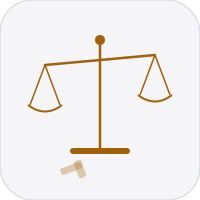
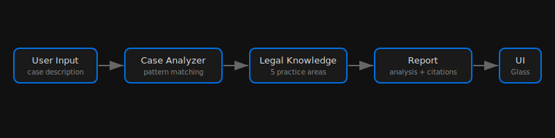

<div align="center">

# Brief



Legal case analyzer. Describe a complaint in plain language, and the analysis engine scores case viability, identifies legal issues, and suggests next steps.

</div>

## Architecture



## Stack

- **Vite 7** — dev server and build tool
- **Vanilla JavaScript** — no framework, ES modules
- **animate.css** — entrance/exit animations
- **Apple Liquid Glass** — frosted glass cards, backdrop-filter blur, dark theme

## Project Structure

```
brief/
  index.html          Entry point (textarea + results shell)
  package.json        Vite 7 + animate.css
  src/
    main.js           App bootstrap, event listeners, state
    analysis.js       Mock analysis engine (keyword detection, scoring)
    ui.js             DOM rendering (results, loading states)
    style.css         Base reset, design tokens, glass primitives
    hero.css          Hero section + textarea input styles
    results.css       Results grid, gauge, tags, steps timeline
    layout.css        Footer, loading spinner, utility buttons
```

## Legal Areas Covered

- Employment Law (wrongful termination, harassment, discrimination)
- Landlord-Tenant Law (eviction, deposits, repairs)
- Personal Injury (negligence, accidents, medical)
- Consumer Protection (fraud, defective products, billing)
- Family Law (custody, divorce, support)

## Development

```bash
npm install
npm run dev
```

Build for production:

```bash
npm run build
npm run preview
```

## License

MIT 2026 Joshua Trommel

## Quick Commands
- `./scripts/simplify.sh` - normalize project structure
- `./scripts/monetize.sh . --write` - generate monetization plan (if available)
- `./scripts/audit.sh .` - run fast project audit (if available)
- `./scripts/ship.sh .` - run checks and ship (if available)
