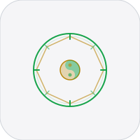
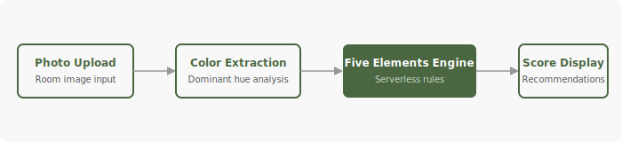

<div align="center">
  
  <h1>Chi</h1>
</div>


Feng Shui room analyzer PWA. Upload room photos, get Five Elements scoring.

GitHub: https://github.com/nulljosh/chi

## Stack
- React 18 + Vite
- vite-plugin-pwa (offline support)
- Serverless rules engine (no AI/API keys)

## Architecture



## Development

```bash
npm install
npm run dev    # localhost:5173
npm run build  # production build
```

## How It Works
1. Upload a room photo
2. Color extraction identifies dominant hues
3. Five Elements engine scores the room balance
4. Get recommendations for better feng shui

## Roadmap
- [ ] Multiple room analysis
- [ ] Room comparison view
- [ ] Element recommendations
- [ ] Share results
- [ ] History tracking

## Quick Commands
- `./scripts/simplify.sh` - normalize project structure
- `./scripts/monetize.sh . --write` - generate monetization plan (if available)
- `./scripts/audit.sh .` - run fast project audit (if available)
- `./scripts/ship.sh .` - run checks and ship (if available)
