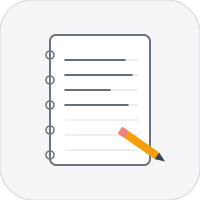
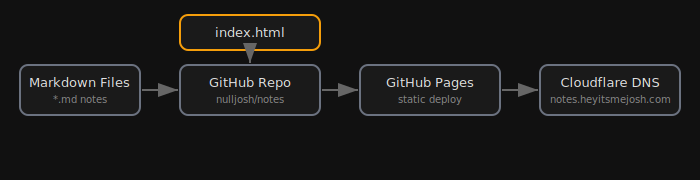

# Notes

Personal notes repo. Converted from PDF brain dumps, maintained as markdown.
[notes.heyitsmejosh.com](https://notes.heyitsmejosh.com) 
## Features
- Plain markdown notes with no frontmatter, kept concise with bullet points
- TODOs tracked with `- [ ]` checkboxes and completed items with `- [x]` for pruning
- `notes/master.md` contains all notes combined: tasks, health, timeline, school, benefits, pixelmator
- `notes/tally.md` covers PWD/DTC disability benefits, contacts, tax credit
- `notes/timeline.md` tracks a 5-year roadmap: college, career, projects
- `notes/school.md` covers UVIC CS transfer requirements, deadlines, prereqs
- `notes/pixelmator.md` documents the Pixelmator + Claude AppleScript workflow
- `notes/health.md` tracks GlyNAC supplement stack, blood work, sinus care
- `index.html` provides the dashboard
- Architecture diagram for the notes system
- `./scripts/simplify.sh` normalizes project structure
## Run
```bash
./scripts/simplify.sh
```
## Roadmap
- [x] Add search across notes and pages
- [ ] Introduce automated link checking for internal references
- [ ] Add a lightweight build step for generating a static index
## Changelog
- v1.0.0
  - Converted PDF brain dumps into maintained markdown notes
  - Added a dashboard index for navigating notes
  - Added `scripts/simplify.sh` to normalize project structure
## License
MIT 2026 Joshua Trommel
